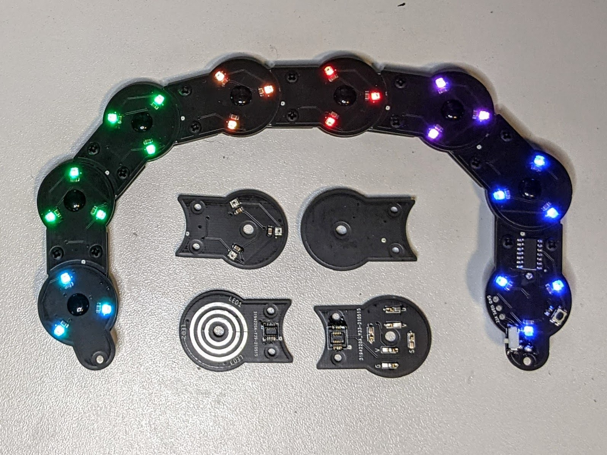
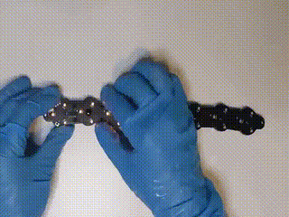
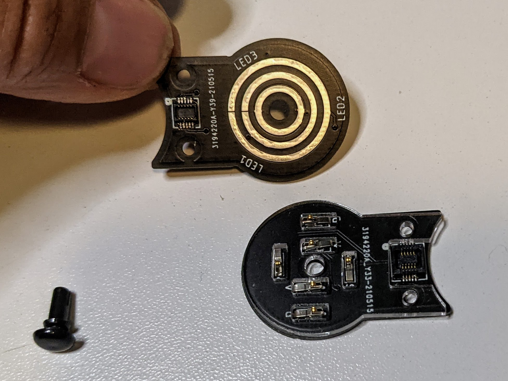
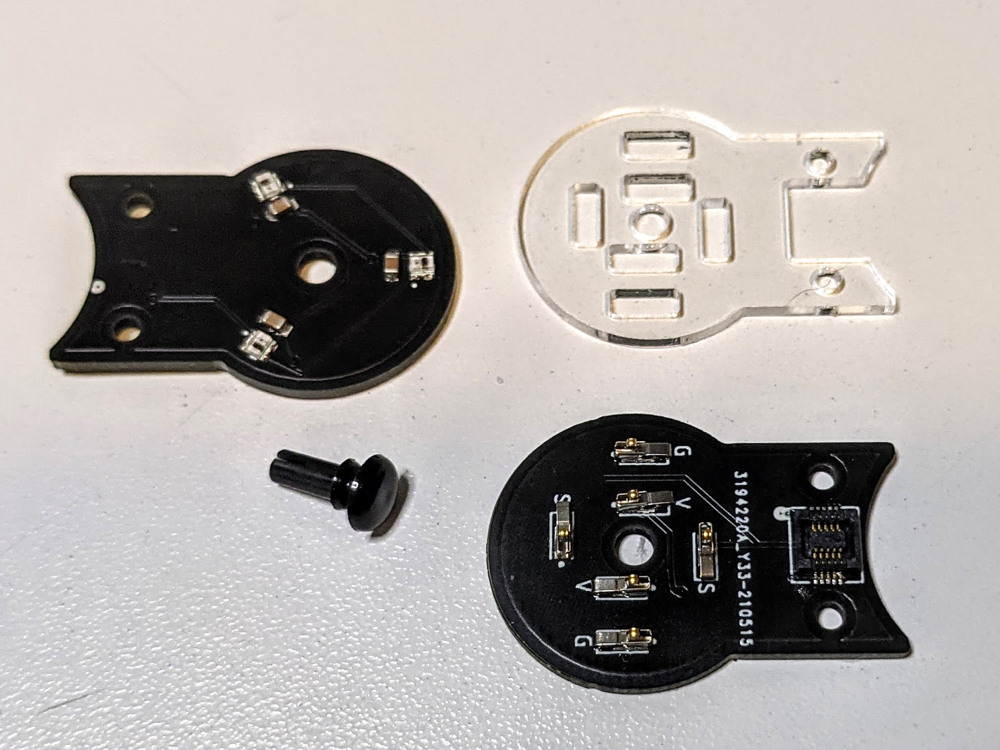

# Articulated PCBs (aka "Bendy Boards")
Design files and BOM for an articulated assembly of PCBs comprised of two-layered links that can pivot around a vertical axis, allowing the assembly to bend at every joint while still maintaining electrical contact between all of the boards in the assembly. 

A demonstration of the boards and the assembly is on <a href="https://www.youtube.com/watch?v=9HDyzVgGNhk">YouTube here:  
</a>

The two layers of each link connect through pressure connectors on the bottom PCB which make contact with cocentric ring-shaped pads on the top one. A laser-cut buffer layer of 1.6mm (1/16") acrylic between the two PCBs prevents the connectors from being crushed. The connectors have a working height of 1.7 mm, which prevents the connectors from being crushed between the PCBs. The layers in the link are held together with an M3 nylon push rivet (specified in BOM)  
 
